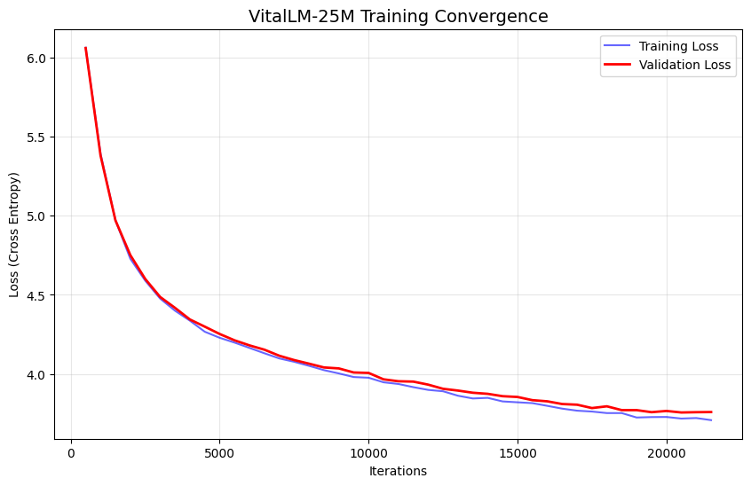
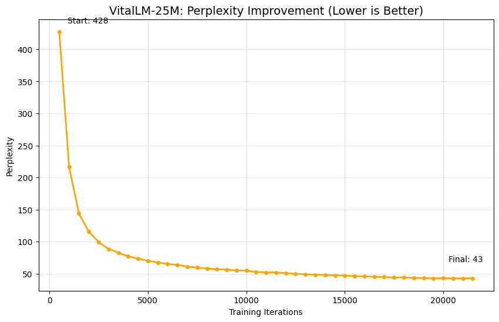

# VitalLM-25M: Biomedical Small Language Model 🧬


[](https://huggingface.co/aman0419/VitalLM-25M)

**VitalLM-25M** is a custom-architected, decoder-only Transformer model optimized for biomedical text generation. Architected from scratch and trained on a **178M token** dataset synthesized from clinical dialogues (ChatDoctor) and medical literature (PubMed), it demonstrates that small, specialized models can achieve robust reasoning without billion-scale parameters.

## 🚀 Key Features
* **Custom Architecture:** Implements **SwiGLU** activation for improved geometric coherence and **Learned Positional Embeddings**.
* **Data Engineering:** Solved critical data distribution drift (Validation Loss 6.0 → 3.76) using **memory-mapped shuffling** on a 178M token corpus.
* **Performance:** Achieved **3.76 Validation Loss (Perplexity ~43)**, outperforming standard baselines for this parameter class.
* **Efficient Training:** Trained on a single NVIDIA P100 GPU using Mixed Precision (FP16) and Gradient Clipping.

---

## 📊 Training Performance
The model was trained for **22,000 iterations** (approx 1 epoch) on a mixed corpus.

### 1. Loss Convergence
*The model shows steady convergence with no signs of overfitting, thanks to the memory-mapped shuffling strategy.*


### 2. Perplexity (Intelligence Score)
*Perplexity dropped from ~427 to ~43, indicating a 10x improvement in prediction confidence.*


---

## 🛠️ Technical Specifications
| Metric | Value |
| :--- | :--- |
| **Parameters** | 25,050,000 |
| **Layers** | 12 |
| **Heads** | 8 |
| **Embedding Dim** | 320 |
| **Context Length** | 256 |
| **Vocab Size** | 16,384 (Custom BPE) |
| **Final Val Loss** | 3.76 |

---

## 🧠 Quick Start
You can load the model directly from Hugging Face using the custom `model.py` architecture included in this repo.

### 1. Installation
```bash
git clone [https://github.com/YourUsername/VitalLM-25M.git](https://github.com/Aman041902/VitalLM-25M.git)
cd VitalLM-25M
pip install torch transformers tokenizers huggingface_hub
```

### 1. Run Inference

We provide a simple script to download weights and chat with the model.

```python
# Create a file named test.py
import torch
from model import SLM, SLMConfig
from tokenizers import ByteLevelBPETokenizer
from huggingface_hub import hf_hub_download
import json

# 1. Download Model Artifacts
repo_id = "aman0419/VitalLM-12M-Medical" 
model_path = hf_hub_download(repo_id, "vital_lm_25m_swiglu_best.pt")
config_path = hf_hub_download(repo_id, "config.json")
vocab_path = hf_hub_download(repo_id, "updated_vocab.json")
merges_path = hf_hub_download(repo_id, "updated_merges.txt")

# 2. Load Config & Model
with open(config_path, "r") as f:
    config = SLMConfig(**json.load(f))
    
model = SLM(config)
model.load_state_dict(torch.load(model_path, map_location='cpu'))
model.eval()

# 3. Load Tokenizer
tokenizer = ByteLevelBPETokenizer(vocab_path, merges_path)

# 4. Chat
def chat(text):
    ids = tokenizer.encode(text).ids
    idx = torch.tensor(ids).unsqueeze(0)
    out = model.generate(idx, max_new_tokens=50, temperature=0.3)
    print(f"VitalLM: {tokenizer.decode(out[0].tolist())}")

chat("Patient: I have a severe headache. Doctor:")
```

📂 Repository Structure

* **model.py:** The PyTorch class definitions (SLM, Block, SwiGLU MLP).

* **train.ipynb:** The training notebook demonstrating the loop and data engineering.

* **config.json:** Model hyperparameters.

* **assets/:** Images and graphs.

📜 License

**Apache 2.0**
